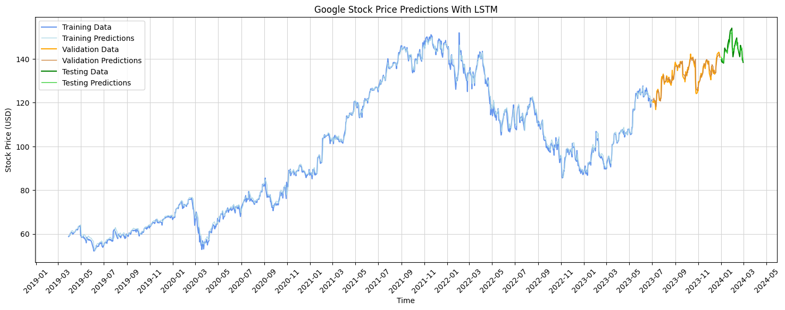
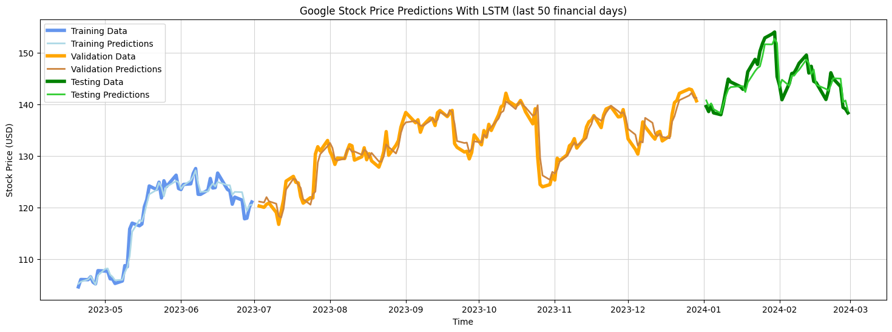

# LSTM Time Series - Multivariate Stock Price Prediction
This project implements a time series multivariate analysis using RNN/LSTM for stock price predictions. A deep RNN model was created and trained on five years of historical Google stock price data to forecast the stock performance over a two-month period.

## Data Set ([Google Stock Price](https://finance.yahoo.com/quote/GOOG/history))
The dataset utilized comprises historical records for the stock price of [Alphabet Inc. (GOOG)](https://finance.yahoo.com/quote/GOOG/history), captured on daily basis.

The dataset is sourced from [Yahoo Finance](https://finance.yahoo.com/) and contains the following fields: *Opening price, Highest price, Lowest price, Closing price, Adjusted closing price, and Trading volume*.

Initially, the entire dataset was explored and then a specific time period was selected to perform training, validation, and predictions as follows:

- **Training data:** from Jan 2019 till June 2023.
- **Validation data:** from July 2023 till Dec 2023.
- **Testing data:** first two months of 2024.

The raw, interim, and preprocessed datasets can be located in their corresponding subfolders in the main [data](data) directory.

## Stock Prediction Details
The project is implemented in three consecutive phases simulating the essential data processing and analysis steps.  
- Each phase is represented in a corresponding notebook inside the [notebooks](notebooks) directory.
- Intermediary data files are stored inside the [data](data) directory.
- Auxiliary and final models are stored inside the [models](models) directory.

### PHASE 1 - Explanatory Data Analysis
> Corresponding notebook:  [data-explanatory-analysis.ipynb](https://github.com/sinanw/lstm-stock-price-prediction/blob/main/notebooks/1-data-explanatory-analysis.ipynb)

Implemented data exploration tasks:
1. Download and load the raw dataset file.
2. Explore dataset summary and statistics.
3. Perform initial data cleaning and type validation.
4. Analyze the stock performance data over time.
5. Select a specific period for analysis and filter data accordingly.
6. Store filtered dataset file to a local folder.

### PHASE 2 - Data Preprocessing
> Corresponding notebook:  [data-preprocessing.ipynb](https://github.com/sinanw/lstm-stock-price-prediction/blob/main/notebooks/2-data-preprocessing.ipynb)

Implemented data processing and transformation tasks:
1. Load the filtered dataset file.
2. Validate and correct data types.
3. Select independent and target features.
4. Create training, validation, and testing splits.
5. Scale datasets to a [0,1] range using [MinMaxScaler](https://scikit-learn.org/stable/modules/generated/sklearn.preprocessing.MinMaxScaler.html).
6. Store processed data files (train, validate, test) to a local folder.

### PHASE 3 - Model Training and Inference
> Corresponding notebook:  [model-training.ipynb](https://github.com/sinanw/lstm-stock-price-prediction/blob/main/notebooks/3-model-training.ipynb)

Implemented training and prediction tasks:
1. Load preprocessed dataset files (train, validate, test).
2. Construct data structures by creating input sequences.
3. Build LSTM Model using [TenserFlow Sequential](https://www.tensorflow.org/api_docs/python/tf/keras/Sequential):
    - First [Input](https://www.tensorflow.org/api_docs/python/tf/keras/layers/InputLayer) layer.
    - 4x [LSTM](https://www.tensorflow.org/api_docs/python/tf/keras/layers/LSTM) layers: units = 100
    - 4x [Dropout](https://www.tensorflow.org/api_docs/python/tf/keras/layers/Dropout) layers: rate = 0.2
    - Final [Dense](https://www.tensorflow.org/api_docs/python/tf/keras/layers/Dense) layer with a single unit.
4. Compile LSTM model:
    - Optimizer: [Adam](https://www.tensorflow.org/api_docs/python/tf/keras/optimizers/Adam)
    - Loss: [Mean Squared Error](https://www.tensorflow.org/api_docs/python/tf/keras/losses/MeanSquaredError)
5. Train LSTM model:
    - Epochs: 200
    - Batch size: 64
6. Evaluate model performance: training and validation losses.
7. Predict future stock prices across training, validation, and testing periods.
8. Inverse scale predictions to their original distribution.
9. Visualize and analyze predictions.

## Prediction Results

Google stock price predictions with LSTM:

Google stock price predictions with LSTM (last 50 financial days):

